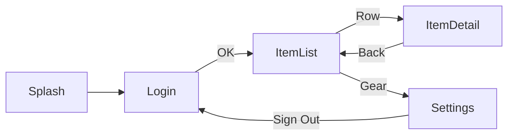

# BASIC_DESIGN.md

## 1. アプリ概要
Android/iOS ネイティブの最小構成検証用アプリ。画面数: 5。
Splash / Login / ItemList / ItemDetail / Settings

## 2. 画面一覧
| # | 英名 | 日本語 | 主な要素 | 遷移先 |
|---|---|---|---|---|
| S1 | Splash | 起動 | ロゴ | Login |
| S2 | Login | ログイン | email/password/Sign In | ItemList |
| S3 | ItemList | 一覧 | List/Pull to Refresh/Settings | ItemDetail, Settings |
| S4 | ItemDetail | 詳細 | Title/Desc/Back/Favorite | ItemList |
| S5 | Settings | 設定 | Sign Out/Theme | Login |

## 3. 遷移図

## 4. データモデル
- Item { id, title, description, isFavorite }
- User { id, email, displayName }

## 5. モック API (実装は MockRepository)
| Endpoint | Method | 遅延 |
|---|---|---|
| /login | POST | 500ms |
| /items | GET | 300ms |
| /items/{id} | GET | 200ms |
| /items/{id}/favorite | PUT | 100ms |

## 6. 検証用ログイン
| email | password | 結果 |
|---|---|---|
| demo@example.com | password | 成功 |
| その他 | 任意 | 失敗 (login_error_text 表示) |

## 7. アーキテクチャ
Presentation: Compose/SwiftUI, ViewModel: 標準, Repository: Mock のみ, DI: Manual (軽量化)

## 8. accessibility ID 命名規約
形式: <screen>_<component>_<role> (小文字スネーク)。詳細: docs/TESTID_CATALOG.md

## 9. 参照ドキュメント
- 状態別表示: docs/UI_STATE_MATRIX.md
- 共通 Given: docs/GIVEN_STATE_LIBRARY.md
- ワイヤーフレーム: docs/screenshots/
